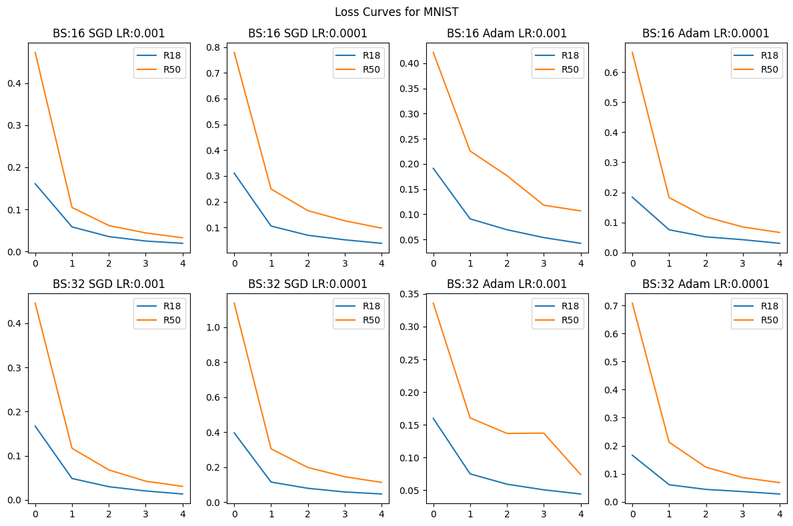
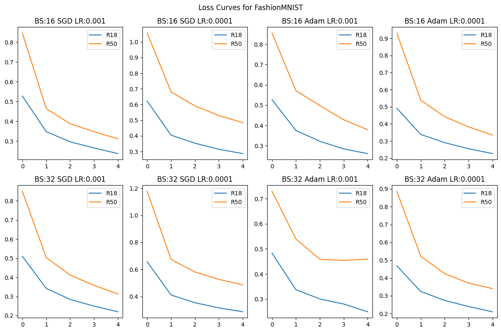

# DL-Ops Lab Assignment-1: Deep Learning Model Training and Analysis

**Author:** Yogesh Sharma (B22CH045)  
**Course:** CSL7210 ML-DL-Ops

## Overview

This assignment presents a comprehensive analysis of deep learning models trained on MNIST and FashionMNIST datasets. The study evaluates ResNet-18 and ResNet-50 architectures with various hyperparameter configurations, compares their performance with SVM classifiers, and analyzes computational efficiency differences between CPU and GPU implementations.

## Experimental Setup

### Datasets
- **MNIST**: 70,000 grayscale images of handwritten digits (0-9), 28×28 pixels
- **FashionMNIST**: 70,000 grayscale images of fashion items across 10 categories, 28×28 pixels
- Both datasets resized to 32×32 pixels and converted to 3-channel format
- **Data Split**: 70% train, 10% validation, 20% test

### Models
- ResNet-18 (pretrained=False)
- ResNet-50 (pretrained=False)

### Hyperparameters
- **Batch sizes**: 16, 32
- **Optimizers**: SGD (momentum=0.9), Adam
- **Learning rates**: 0.001, 0.0001
- **Epochs**: 5 and 10
- **AMP**: Enabled (USE_AMP=True) for all experiments

---

## Question 1(a): ResNet Training on MNIST and FashionMNIST

### Results

#### Table 1: Test Classification Accuracy (%) for MNIST Dataset

| Batch Size | Optimizer | Learning Rate | ResNet-18 | ResNet-50 |
|------------|-----------|---------------|-----------|-----------|
| 16 | SGD | 0.001 | 98.92 | 98.57 |
| 16 | SGD | 0.0001 | 98.87 | 97.79 |
| 16 | Adam | 0.001 | 98.95 | 98.69 |
| 16 | Adam | 0.0001 | 98.92 | 98.06 |
| 32 | SGD | 0.001 | 99.04 | 98.51 |
| 32 | SGD | 0.0001 | 98.43 | 96.61 |
| 32 | Adam | 0.001 | 98.93 | 97.98 |
| 32 | Adam | 0.0001 | 98.89 | 97.43 |

#### Table 2: Test Classification Accuracy (%) for FashionMNIST Dataset

| Batch Size | Optimizer | Learning Rate | ResNet-18 | ResNet-50 |
|------------|-----------|---------------|-----------|-----------|
| 16 | SGD | 0.001 | 90.55 | 88.51 |
| 16 | SGD | 0.0001 | 89.66 | 84.71 |
| 16 | Adam | 0.001 | 90.67 | 87.26 |
| 16 | Adam | 0.0001 | 90.21 | 88.36 |
| 32 | SGD | 0.001 | 89.22 | 87.69 |
| 32 | SGD | 0.0001 | 88.43 | 83.82 |
| 32 | Adam | 0.001 | 90.37 | 77.94 |
| 32 | Adam | 0.0001 | 90.86 | 87.70 |

### Loss Curves

#### MNIST Loss Curves

The loss curves for MNIST show that ResNet-18 consistently achieves lower training loss than ResNet-50 across all hyperparameter configurations. Both models show rapid loss reduction in the first epoch, with ResNet-18 reaching lower final loss values (approximately 0.01-0.05) compared to ResNet-50 (approximately 0.03-0.12).

#### FashionMNIST Loss Curves

The loss curves for FashionMNIST reveal that ResNet-18 consistently achieves lower training loss (final loss around 0.22-0.30) compared to ResNet-50 (final loss around 0.32-0.50). ResNet-50 starts with higher initial loss and converges more slowly, particularly with lower learning rates. The most dramatic difference is observed with batch size 32, SGD, and learning rate 0.0001, where ResNet-50 starts at approximately 1.18 loss compared to ResNet-18's 0.65.

### Key Findings

- **ResNet-18 consistently outperforms ResNet-50** on both datasets
- **MNIST**: ResNet-18 achieves 98.43%-99.04% accuracy; ResNet-50 achieves 96.61%-98.69%
- **FashionMNIST**: ResNet-18 achieves 88.43%-90.86% accuracy; ResNet-50 achieves 77.94%-88.51%
- **Best Performance**: 
  - MNIST: 99.04% (ResNet-18, batch size 32, SGD, LR 0.001)
  - FashionMNIST: 90.86% (ResNet-18, batch size 32, Adam, LR 0.0001)
- All configurations achieve above 80% accuracy on FashionMNIST and above 97% on MNIST
- **Loss Curve Insights**: 
  - ResNet-18 shows faster convergence and lower final loss values
  - Lower learning rates result in slower convergence, particularly for ResNet-50
  - FashionMNIST presents more optimization challenges, reflected in higher loss values

---

## Question 1(b): SVM Classification

### Results

#### Table 3: SVM Classification Results

| Dataset | Kernel | Test Accuracy (%) | Training Time (ms) |
|---------|--------|-------------------|-------------------|
| MNIST | poly | 97.99 | 443,644 |
| MNIST | rbf | 97.89 | 661,262 |
| FashionMNIST | poly | 89.50 | 844,565 |
| FashionMNIST | rbf | 88.87 | 952,153 |

### Key Findings

- **SVM Performance**: Competitive with deep learning models (88.87%-97.99%)
- **Polynomial kernel** slightly outperforms RBF kernel on both datasets
- **Training times**: Significantly longer than deep learning models (7-16 minutes vs. seconds/minutes on GPU)
- ResNet-18 achieves higher accuracy than SVM on both datasets

---

## Question 2: CPU vs. GPU Performance Analysis

### Results

#### Table 4: Hardware Performance Comparison on FashionMNIST Dataset

| Compute | BS | Optimizer | LR | Test Accuracy (%) | Train Time (ms) | FLOPs |
|---------|----|-----------|----|-------------------|-----------------|-------|
| | | | | R18 | R50 | R18 | R50 | R18 | R50 |
| CPU | 16 | SGD | 0.001 | 85.94 | 83.16 | 578,479 | 1,381,111 | 37.2M | 84.3M |
| CPU | 16 | Adam | 0.001 | 87.40 | 82.98 | 816,487 | 1,758,394 | 37.2M | 84.3M |
| GPU | 16 | SGD | 0.001 | 86.99 | 81.93 | 43,956 | 75,700 | 37.2M | 84.3M |
| GPU | 16 | Adam | 0.001 | 85.13 | 80.60 | 44,321 | 87,726 | 37.2M | 84.3M |

**Note:** R18 = ResNet-18, R50 = ResNet-50

### Key Findings

- **GPU Speedup**: 13-20x faster than CPU
  - ResNet-18: ~13.2x (SGD), ~18.4x (Adam)
  - ResNet-50: ~18.2x (SGD), ~20.0x (Adam)
- **Accuracy**: Minimal differences between CPU and GPU (within 0.5-2.3 percentage points)
- **FLOPs**: 
  - ResNet-18: 37,220,352 FLOPs
  - ResNet-50: 84,342,784 FLOPs (2.27x more than ResNet-18)
- **Training Time Correlation**: Training time scales approximately linearly with FLOP count on GPU

---

## Overall Conclusions

1. **ResNet-18 Superiority**: Consistently outperforms ResNet-50 with lower computational cost
2. **Task Difficulty**: FashionMNIST is more challenging than MNIST (8-10% accuracy drop)
3. **GPU Acceleration**: Essential for efficient training (13-20x speedup with minimal accuracy impact)
4. **SVM Competitiveness**: Achieves competitive accuracy but requires significantly longer training times
5. **Hyperparameter Robustness**: Both ResNet models are robust to hyperparameter variations

---

## Files

- `B22CH045_Yogesh_Sharma_Ass1_1.ipynb`: Main experiment notebook (Q1a, Q1b)
- `B22CH045_Yogesh_Shamra_Ass1_2.ipynb`: Hardware comparison notebook (Q2)
- `B22CH045_Yogesh_Sharma_Ass1`: Complete Assignment report
- `image1.png`: FashionMNIST loss curves
- `image2.png`: MNIST loss curves
