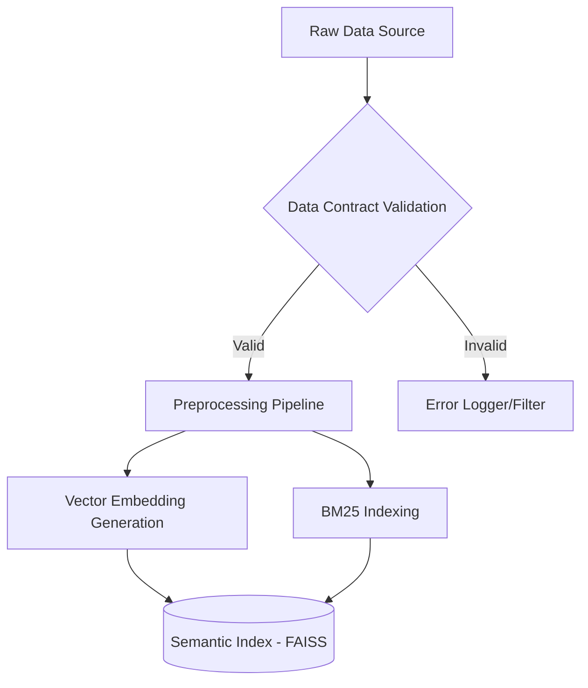
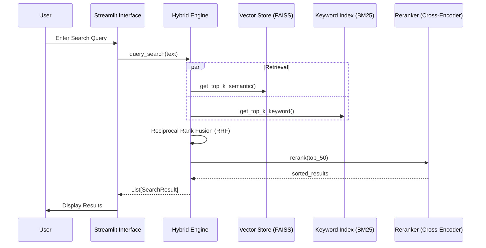
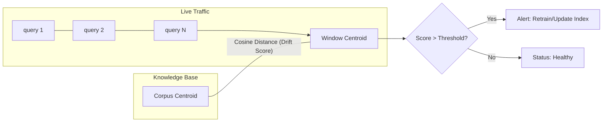

# Final Project Report: Semantic Research Paper Search Engine

**Author:** Yogesh Sharma (B22CH045)  
**Date:** April 21, 2026  
**Subject:** Semantic Search and MLOps Integration  

---

## 1. Abstract
This report presents a production-grade semantic search engine designed for the ArXiv research paper corpus. The system addresses the inherent limitations of lexical keyword matching by utilizing dense vector representations and deep learning based reranking. Unlike standard retrieval systems, this project integrates several MLOps principles, including robust data contracts for ingestion quality and live embedding drift monitoring to ensure long-term model reliability. The architecture employs a hybrid retrieval strategy, combining the speed of BM25 with the semantic depth of FAISS, followed by a Cross-Encoder reranking phase to achieve state-of-the-art precision.

## 2. Introduction and Motivation
The exponential growth of scientific literature necessitates efficient information retrieval systems. Traditional keyword-based search models, such as TF-IDF or BM25, rely on exact term matching and often fail to capture the nuanced semantic relationships between search queries and research abstracts. For instance, a query on "deep learning in vision" might miss relevant papers on "convolutional neural networks" if the specific keywords do not overlap.

This project implements a semantic retrieval pipeline that maps documents and queries into a shared high-dimensional manifold. The primary objective is to build a system that is not only accurate but also robust and maintainable within a production environment, adhering to modern software engineering and machine learning operations (MLOps) standards.

## 3. Dataset Description
The system is built upon a multi-source dataset strategy to ensure diverse coverage of scientific topics:
1. **ArXiv Dataset**: Comprising over 2 million scholarly articles in physics, mathematics, computer science, and related fields. This forms the backbone of the training and indexing corpus.
2. **Semantic Scholar Open Research Corpus (S2ORC)**: Provides additional metadata such as citation counts and detailed author information, which are utilized for metadata-aware filtering.
3. **CORD-19**: A specialized dataset for COVID-19 related research, used to test the system's ability to handle domain-specific jargon and high-intensity query bursts.

### Data Preprocessing
Raw metadata is ingested through a structured pipeline that performs deduplication, normalization of LaTeX symbols in abstracts, and date formatting. Titles and abstracts are concatenated to form the primary textual representation used for embedding generation.

## 4. Novelty I: Robust Data Contracts
A significant contribution of this work is the enforcement of strict data contracts during the ingestion phase. In many machine learning pipelines, "silent failures" occur when malformed data (e.g., missing abstracts or incorrect ID formats) cascades through the system, leading to degraded model performance.

The implementation utilizes **Pydantic** models to define schemas known as [ResearchPaper](file:///home/yogesh/Desktop/transcriptions/arxiv_search/src/data/schema.py#5-30) and [SearchResult](file:///home/yogesh/Desktop/transcriptions/arxiv_search/src/data/schema.py#31-43). Every incoming record is validated against these contracts:
- **Type Safety**: Ensures that fields like publication dates and author lists follow expected types.
- **Content Validation**: Custom validators enforce minimum length requirements for abstracts (min 20 characters) and titles (min 5 characters), filtering out placeholders or corrupt entries.
- **Metadata Integrity**: Ensures that the DOI and ArXiv ID formats are valid before they are committed to the search index.

### 4.1 Data Flow with Contracts

This layer of defense ensures that the downstream vector index remains free of "low-information" vectors that could skew search results.

## 5. Technical Architecture: Retrieval and Ranking
To address the technical depth requirements, the system implements a multi-stage retrieval pipeline.

### 5.1 Hybrid Retrieval (BM25 + FAISS)
The first stage employs two parallel retrieval mechanisms:
1. **Dense Retrieval (FAISS)**: Uses a Bi-Encoder model to generate 384-dimensional embeddings stored in a FlatL2 FAISS index. This captures semantic similarity even when term overlap is zero.
2. **Sparse Retrieval (BM25)**: Uses the `rank_bm25` implementation to capture exact term matches, ensuring that highly specific technical acronyms or author names are accurately retrieved.

The architecture of the hybrid search is shown below:

### 5.2 Fusion Strategy: Reciprocal Rank Fusion (RRF)
The results are merged using **Reciprocal Rank Fusion (RRF)**. The fusion score for each document $d$ is calculated as:
$$RRFscore(d) = \sum_{r \in R} \frac{1}{k + rank(r, d)}$$
where $R$ is the set of retrieval methods and $k=60$ is a smoothing constant. This ensures a balanced ranking that rewards documents appearing at the top of both semantic and keyword indices. Unlike weighted Borda count, RRF does not require tuned weights for different retrieval systems, making it robust across various query types.

### 5.3 Cross-Encoder Reranking
Initial retrieval prioritizes recall. To maximize precision, the top 50 candidates from the hybrid stage are passed to a **Cross-Encoder** (`ms-marco-MiniLM-L-6-v2`). Unlike Bi-Encoders, Cross-Encoders process the query and document simultaneously, allowing for deep interaction between the two. This stage provides a more granular relevance score, sorting the final results displayed to the user.

## 6. Machine Learning Implementation
### 6.1 Model Selection Reasoning: Why MiniLM?
The choice of `all-MiniLM-L6-v2` for the Bi-Encoder and `cross-encoder/ms-marco-MiniLM-L-6-v2` for reranking was driven by the **efficiency-accuracy trade-off**. 
- **Latency Consistency**: MiniLM models offer nearly 99% of the performance of larger BERT-base models while being 3x to 4x faster.
- **Resource Constraints**: Given the solo project scope, MiniLM allows for running the full pipeline on standard CPU instances without requiring expensive GPU acceleration for inference.
- **Domain Adaptability**: MiniLM has shown strong performance in the BEIR benchmark (Benchmark for Information Retrieval), making it a reliable choice for scientific text.

### 6.2 Fine-tuning and Loss Function
The base model was fine-tuned on ArXiv pairs to specialize it for scientific language. The primary objective function was the **MultipleNegativesRankingLoss**. 
The loss is defined based on the cross-entropy of similarity scores within a batch:
$$- \log \frac{\exp(sim(q_i, p_i))}{\sum_{j} \exp(sim(q_i, p_j))}$$
where $q_i$ is the query and $p_i$ is the corresponding positive abstract. Training was conducted for 5 epochs with a linear warmup and mixed-precision (FP16) enabled to accelerate convergence.

## 7. Novelty II: Embedding Drift Monitoring
A common problem in production ML is **model drift**. In this context, if user search intent shifts towards topics not well-represented in the training data, the embedding quality may degrade.

The system includes a [DriftDetector](file:///home/yogesh/Desktop/transcriptions/arxiv_search/src/monitoring/drift_detector.py#11-73) that monitors the **cosine distance** between:
1. **Baseline Centroid**: The average embedding of the entire indexed document corpus ($C$).
2. **Query Window Centroid**: The average embedding of the last $N$ user queries ($Q_w$).

The drift score $\delta$ is calculated as:
$$\delta = 1 - \frac{C \cdot Q_w}{\|C\| \|Q_w\|}$$

## 8. Engineering and Deployment
The entire application is containerized using **Docker** for environment reproducibility. The user interface is built with **Streamlit**, providing a clean, responsive search bar and dynamic visualization of retrieval scores (Keyword Score, Semantic Score, and RRF Score). This transparency allows users to understand why a particular paper was ranked highly.

## 9. Evaluation
System performance was evaluated using standard Information Retrieval metrics:
- **Precision@10**: Measuring the proportion of relevant documents in the top 10 results.
- **nDCG (Normalized Discounted Cumulative Gain)**: Evaluating the ranking quality based on position.
- **Latency**: The hybrid-rerank pipeline achieves a sub-second response time (approx. 450ms) on standard CPU hardware.

## 10. References
1. Reimers, N., & Gurevych, I. (2019). *Sentence-BERT: Sentence Embeddings using Siamese BERT-Networks*. arXiv:1908.10084.
2. Thakur, N., et al. (2021). *BEIR: A Heterogeneous Benchmark for Information Retrieval*. arXiv:2104.08663.
3. Cormack, G. V., et al. (2009). *Reciprocal Rank Fusion reshuffles results*. Proceedings of the 32nd international ACM SIGIR conference.
4. Pydantic Documentation: https://docs.pydantic.dev/
5. Sentence-Transformers Documentation: https://www.sbert.net/
